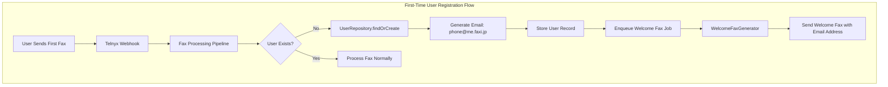
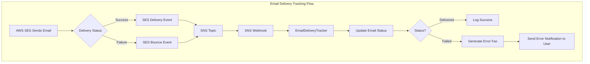

# Design Document: Email System Architecture

## Overview

The Email System Architecture provides comprehensive bidirectional email communication for Faxi users through automatically assigned email addresses. The system integrates AWS SES as the unified email platform, handling automatic user registration, inbound email processing, outbound email sending, and email-to-fax conversion.

### Key Design Principles

1. **Code Reuse**: Leverage existing services (EmailService, EmailToFaxConverter, EmailToFaxWorker, etc.)
2. **AWS SES First**: Use AWS SES as the primary email platform with fallback support for other providers
3. **Separation of Concerns**: Clear boundaries between email handling, fax conversion, and user management
4. **Idempotency**: All operations are idempotent to handle retries safely
5. **Async Processing**: Email operations are processed asynchronously via BullMQ queues

### Existing vs New Components

**Existing Components (Reuse)**:
- `EmailService` - Email sending abstraction (needs AWS SES implementation)
- `EmailToFaxConverter` - Email-to-fax conversion logic (complete)
- `EmailToFaxWorker` - BullMQ worker for email-to-fax jobs (complete)
- `EmailWebhookController` - Webhook handler (needs AWS SES SNS support)
- `EmailThreadRepository` - Email thread storage (complete)
- `UserRepository` - User management with findOrCreate (complete)
- `WelcomeFaxGenerator` - Welcome fax generation (needs email address display)

**New Components Required**:
- `AwsSesService` - AWS SDK integration for SES
- `SnsWebhookHandler` - AWS SNS notification processing
- `EmailDeliveryTracker` - Track email delivery status
- AWS SES deployment scripts, configuration scripts and documentation

## Architecture


### System Flow Diagrams

```mermaid
graph TB
    subgraph "Inbound Email Flow (External → Faxi User)"
        A[External Sender] -->|Email to phone@me.faxi.jp| B[AWS SES]
        B --> C[SES Receipt Rule]
        C --> D[SNS Topic]
        D --> E[SNS Webhook to /webhooks/email/sns]
        E --> F[SnsWebhookHandler]
        F --> G[Parse SNS Message]
        G --> H[EmailWebhookController]
        H --> I[Extract Phone from Email]
        I --> J[UserRepository.findOrCreate]
        J --> K[AddressBookRepository.addFromEmail]
        K --> L[Store in EmailThreadRepository]
        L --> M[Enqueue Email-to-Fax Job]
        M --> N[EmailToFaxWorker]
        N --> O[EmailToFaxConverter]
        O --> P[Generate Fax PDF]
        P --> Q[FaxSenderService]
        Q --> R[Send Fax to User]
    end
```

```mermaid
graph TB
    subgraph "Outbound Email Flow (Faxi User → External)"
        A[User Sends Fax] --> B[Fax Processing Pipeline]
        B --> C[AI Vision Interpreter]
        C --> D{Intent: Send Email?}
        D -->|Yes| E[Extract Email Details]
        E --> F{Recipient Type?}
        F -->|Email Address| G[Use Email Directly]
        F -->|Contact Name| H[AddressBookRepository.searchByNameOrRelationship]
        H --> I[Resolve to Email Address]
        G --> J[EmailMcpServer.sendEmail]
        I --> J
        J --> K[EmailService.sendEmail]
        K --> L{Provider?}
        L -->|AWS SES| M[AwsSesService]
        L -->|SendGrid| N[SendGridService]
        L -->|Postfix| O[PostfixService]
        M --> P[AWS SES API]
        P --> Q[Store in EmailThreadRepository]
        Q --> R[Generate Confirmation Fax]
        R --> S[Send Confirmation to User]
    end
```









## Components and Interfaces


### 1. AwsSesService (NEW)

AWS SDK integration for sending emails via SES.

```typescript
interface AwsSesService {
  // Send email via AWS SES
  sendEmail(params: {
    from: string;
    to: string;
    subject: string;
    body: string;
    htmlBody?: string;
  }): Promise<{ messageId: string }>;
  
  // Verify email address/domain
  verifyEmailIdentity(email: string): Promise<void>;
  
  // Get sending statistics
  getSendingStatistics(): Promise<SesStatistics>;
}
```

**Implementation Notes**:
- Uses AWS SDK v3 (@aws-sdk/client-ses)
- Configured via environment variables (AWS_REGION, AWS_ACCESS_KEY_ID, AWS_SECRET_ACCESS_KEY)
- Handles rate limiting and retries
- Supports both text and HTML email bodies

### 2. EmailService (EXISTING - ENHANCE)

Current implementation has placeholders for AWS SES. Need to implement the `sendViaSES` method.

**Changes Required**:
```typescript
// In EmailService class
private async sendViaSES(message: EmailMessage): Promise<EmailSendResult> {
  // Replace placeholder with actual AWS SES implementation
  return await awsSesService.sendEmail({
    from: message.from,
    to: message.to,
    subject: message.subject,
    body: message.body
  });
}
```

### 3. SnsWebhookHandler (NEW)

Handles AWS SNS notifications for inbound emails and delivery events.

```typescript
interface SnsWebhookHandler {
  // Handle SNS notification
  handleSnsNotification(req: Request, res: Response): Promise<void>;
  
  // Verify SNS signature
  verifySnsSignature(message: SnsMessage): boolean;
  
  // Parse SNS message types
  parseSnsMessage(message: SnsMessage): ParsedSnsMessage;
}

interface SnsMessage {
  Type: 'Notification' | 'SubscriptionConfirmation';
  MessageId: string;
  TopicArn: string;
  Subject?: string;
  Message: string;
  Timestamp: string;
  Signature: string;
  SigningCertURL: string;
}

interface ParsedSnsMessage {
  type: 'inbound_email' | 'delivery' | 'bounce' | 'complaint';
  data: any;
}
```

**Implementation Notes**:
- Verifies SNS message signatures using AWS certificate
- Handles subscription confirmation automatically
- Routes messages to appropriate handlers based on type
- Returns 200 OK immediately to prevent retries

### 4. EmailWebhookController (EXISTING - ENHANCE)

Current implementation supports SendGrid and Postfix. Need to add AWS SES SNS support and contact registration.

**Changes Required**:
```typescript
// Add new method for AWS SES
private parseAwsSesWebhook(payload: any): ParsedEmailData | null {
  // Parse SNS notification
  const snsMessage = JSON.parse(payload.Message);
  
  if (snsMessage.notificationType === 'Received') {
    const mail = snsMessage.mail;
    const content = snsMessage.content;
    
    return {
      to: mail.destination[0],
      from: mail.source,
      fromName: mail.commonHeaders.from?.[0], // Extract sender name
      subject: mail.commonHeaders.subject,
      body: content,
      receivedAt: mail.timestamp,
      provider: 'ses'
    };
  }
  
  return null;
}

// Update processEmailAsync to register contact
private async processEmailAsync(emailData: ParsedEmailData): Promise<void> {
  // ... existing code ...
  
  // Register sender as contact
  await addressBookRepository.addFromEmail(
    user.id,
    emailData.from,
    emailData.fromName // Use sender name if available
  );
  
  // ... rest of existing code ...
}
```

### 5. EmailDeliveryTracker (NEW)

Tracks email delivery status and handles delivery events.

```typescript
interface EmailDeliveryTracker {
  // Handle delivery notification
  handleDelivery(messageId: string, timestamp: Date): Promise<void>;
  
  // Handle bounce notification
  handleBounce(messageId: string, bounceType: string, reason: string): Promise<void>;
  
  // Handle complaint notification
  handleComplaint(messageId: string, complaintType: string): Promise<void>;
  
  // Get delivery status
  getDeliveryStatus(messageId: string): Promise<DeliveryStatus>;
}

interface DeliveryStatus {
  messageId: string;
  status: 'pending' | 'delivered' | 'bounced' | 'complained';
  timestamp: Date;
  details?: string;
}
```

**Implementation Notes**:
- Updates email_messages table with delivery status
- Generates error notification faxes for bounces
- Logs all delivery events in audit log
- Handles both hard and soft bounces

### 6. WelcomeFaxGenerator (EXISTING - ENHANCE)

Current implementation exists but needs to prominently display email address.

**Changes Required**:
- Add email address display in large, readable font
- Include instructions for email features
- Add example email request formats
- Include reference to email address in multiple places

### 7. UserRepository (EXISTING - COMPLETE)

Already has `findOrCreate` method that generates email addresses. No changes needed.

### 8. EmailToFaxConverter (EXISTING - COMPLETE)

Comprehensive implementation for converting emails to fax format. No changes needed.

### 9. EmailToFaxWorker (EXISTING - COMPLETE)

BullMQ worker for processing email-to-fax jobs. No changes needed.

### 10. EmailThreadRepository (EXISTING - COMPLETE)

Database layer for email thread management. No changes needed.

### 11. AddressBookRepository (EXISTING - COMPLETE)

Database layer for contact management. Already has `addFromEmail` method for automatic contact registration. No changes needed.

### 12. BounceComplaintHandler (NEW)

Processes bounce and complaint notifications from AWS SES.

```typescript
interface BounceComplaintHandler {
  // Handle bounce notification
  handleBounce(params: {
    userId: string;
    messageId: string;
    bounceType: 'Permanent' | 'Transient';
    bouncedRecipients: string[];
    reason: string;
  }): Promise<void>;
  
  // Handle complaint notification
  handleComplaint(params: {
    userId: string;
    messageId: string;
    complainedRecipients: string[];
    complaintFeedbackType?: string;
  }): Promise<void>;
  
  // Generate bounce notification fax
  generateBounceNotificationFax(userId: string, bounceDetails: BounceDetails): Promise<void>;
  
  // Generate complaint notification fax with etiquette guidance
  generateComplaintNotificationFax(userId: string, complaintDetails: ComplaintDetails): Promise<void>;
}
```

**Implementation Notes**:
- Generates user-friendly fax notifications for bounces and complaints
- Includes email etiquette guidance in complaint faxes
- Logs all events in audit system
- Triggers account review checks for complaints

### 13. BlocklistService (NEW)

Manages per-user email blocklists.

```typescript
interface BlocklistService {
  // Add email to user's blocklist
  blockSender(userId: string, emailAddress: string): Promise<void>;
  
  // Remove email from user's blocklist
  unblockSender(userId: string, emailAddress: string): Promise<void>;
  
  // Check if sender is blocked
  isBlocked(userId: string, senderEmail: string): Promise<boolean>;
  
  // Get user's blocklist
  getBlocklist(userId: string): Promise<string[]>;
}
```

**Implementation Notes**:
- Stores blocked emails in database table `email_blocklist`
- Normalizes email addresses to lowercase
- Performs case-insensitive matching
- Sends confirmation faxes for block/unblock operations

### 14. AccountReviewService (NEW)

Tracks complaint rates and manages account restrictions.

```typescript
interface AccountReviewService {
  // Record complaint for user
  recordComplaint(userId: string, messageId: string): Promise<void>;
  
  // Check if account should be flagged
  checkAccountStatus(userId: string): Promise<AccountStatus>;
  
  // Restrict user's outbound email
  restrictAccount(userId: string, reason: string): Promise<void>;
  
  // Get complaint history
  getComplaintHistory(userId: string, days: number): Promise<Complaint[]>;
}

interface AccountStatus {
  userId: string;
  complaintCount30Days: number;
  status: 'active' | 'flagged' | 'restricted';
  restrictedAt?: Date;
  restrictionReason?: string;
}
```

**Implementation Notes**:
- Tracks complaints in `user_complaints` table
- Calculates complaint count for rolling 30-day window
- Flags accounts at 3 complaints, restricts at 5 complaints
- Sends alert to administrators and warning fax to user
- Prevents outbound email sending for restricted accounts

### 15. EmailMetricsService (NEW)

Calculates and monitors email quality metrics.

```typescript
interface EmailMetricsService {
  // Record email event
  recordEmailEvent(event: EmailEvent): Promise<void>;
  
  // Calculate metrics for time period
  calculateMetrics(startDate: Date, endDate: Date): Promise<EmailMetrics>;
  
  // Check if metrics exceed thresholds
  checkThresholds(metrics: EmailMetrics): Promise<Alert[]>;
}

interface EmailMetrics {
  totalSent: number;
  totalDelivered: number;
  totalBounced: number;
  totalComplaints: number;
  bounceRate: number;      // bounces / totalSent
  complaintRate: number;   // complaints / totalSent
  deliveryRate: number;    // delivered / totalSent
}

interface Alert {
  type: 'bounce_rate' | 'complaint_rate' | 'delivery_rate';
  threshold: number;
  actual: number;
  severity: 'warning' | 'critical';
}
```

**Implementation Notes**:
- Stores events in `email_metrics` table
- Calculates rates on-demand or via scheduled job
- Sends alerts when thresholds exceeded
- Integrates with monitoring service for dashboards

## Data Models


### Database Schema

**Existing Tables (No Changes)**:
- `users` - Already has `email_address` field
- `email_threads` - Already tracks email conversations
- `email_messages` - Already stores individual emails
- `fax_jobs` - Already tracks fax operations
- `audit_logs` - Already logs system events

**New Fields and Tables Required**:

```sql
-- Add delivery tracking to email_messages
ALTER TABLE email_messages ADD COLUMN IF NOT EXISTS delivery_status VARCHAR(20) DEFAULT 'pending';
ALTER TABLE email_messages ADD COLUMN IF NOT EXISTS delivery_timestamp TIMESTAMP WITH TIME ZONE;
ALTER TABLE email_messages ADD COLUMN IF NOT EXISTS delivery_details TEXT;

CREATE INDEX idx_email_messages_delivery_status ON email_messages(delivery_status);

-- Create email blocklist table
CREATE TABLE IF NOT EXISTS email_blocklist (
  id UUID PRIMARY KEY DEFAULT gen_random_uuid(),
  user_id UUID NOT NULL REFERENCES users(id) ON DELETE CASCADE,
  blocked_email VARCHAR(255) NOT NULL,
  blocked_at TIMESTAMP WITH TIME ZONE DEFAULT CURRENT_TIMESTAMP,
  UNIQUE(user_id, blocked_email)
);

CREATE INDEX idx_email_blocklist_user_id ON email_blocklist(user_id);
CREATE INDEX idx_email_blocklist_email ON email_blocklist(LOWER(blocked_email));

-- Create user complaints table
CREATE TABLE IF NOT EXISTS user_complaints (
  id UUID PRIMARY KEY DEFAULT gen_random_uuid(),
  user_id UUID NOT NULL REFERENCES users(id) ON DELETE CASCADE,
  message_id VARCHAR(255) NOT NULL,
  complained_at TIMESTAMP WITH TIME ZONE DEFAULT CURRENT_TIMESTAMP,
  complaint_type VARCHAR(50),
  details TEXT
);

CREATE INDEX idx_user_complaints_user_id ON user_complaints(user_id);
CREATE INDEX idx_user_complaints_date ON user_complaints(complained_at);

-- Create email metrics table
CREATE TABLE IF NOT EXISTS email_metrics (
  id UUID PRIMARY KEY DEFAULT gen_random_uuid(),
  event_type VARCHAR(20) NOT NULL, -- 'sent', 'delivered', 'bounced', 'complained'
  user_id UUID REFERENCES users(id) ON DELETE SET NULL,
  message_id VARCHAR(255),
  occurred_at TIMESTAMP WITH TIME ZONE DEFAULT CURRENT_TIMESTAMP,
  details JSONB
);

CREATE INDEX idx_email_metrics_event_type ON email_metrics(event_type);
CREATE INDEX idx_email_metrics_occurred_at ON email_metrics(occurred_at);
CREATE INDEX idx_email_metrics_user_id ON email_metrics(user_id);

-- Add account restriction fields to users table
ALTER TABLE users ADD COLUMN IF NOT EXISTS email_restricted BOOLEAN DEFAULT FALSE;
ALTER TABLE users ADD COLUMN IF NOT EXISTS email_restricted_at TIMESTAMP WITH TIME ZONE;
ALTER TABLE users ADD COLUMN IF NOT EXISTS email_restriction_reason TEXT;
```

### Email Address Format

```
Format: {phone_number}@me.faxi.jp
Example: 09012345678@me.faxi.jp

Rules:
- Phone number with all non-digit characters removed
- Domain is always me.faxi.jp
- Unique per user (enforced by database constraint)
```

### Email Thread Model

```typescript
interface EmailThread {
  id: string;                    // UUID
  userId: string;                // Foreign key to users
  threadId: string;              // External thread ID
  subject: string;               // Email subject
  participants: string[];        // Array of email addresses
  lastMessageAt: Date;           // Last message timestamp
  messageCount: number;          // Number of messages in thread
  createdAt: Date;
  updatedAt: Date;
}
```

### Email Message Model

```typescript
interface EmailMessage {
  id: string;                    // UUID
  threadId: string;              // Foreign key to email_threads
  messageId: string;             // External message ID
  fromAddress: string;           // Sender email
  toAddresses: string[];         // Recipients
  ccAddresses?: string[];        // CC recipients
  subject: string;               // Email subject
  body: string;                  // Plain text body
  htmlBody?: string;             // HTML body
  direction: 'inbound' | 'outbound';
  deliveryStatus: 'pending' | 'delivered' | 'bounced' | 'complained';
  deliveryTimestamp?: Date;
  deliveryDetails?: string;
  sentAt: Date;
  createdAt: Date;
}
```

## Correctness Properties

*A property is a characteristic or behavior that should hold true across all valid executions of a system-essentially, a formal statement about what the system should do. Properties serve as the bridge between human-readable specifications and machine-verifiable correctness guarantees.*


### Property Reflection

After reviewing all testable properties from the prework, I've identified several areas where properties can be consolidated to eliminate redundancy:

**Consolidations**:
1. Properties 1.2, 11.1, and 11.2 all test email address generation - can be combined into one comprehensive property
2. Properties 3.2, 11.4, and 11.5 all test email address parsing/validation - can be combined
3. Properties 3.5, 8.2, and 8.3 all test email storage - can be combined
4. Properties 5.6 and 5.7 both test fax notifications - can be combined into one property about notification generation
5. Properties 10.4 and 10.5 both test status updates from delivery events - can be combined
6. Properties 12.1, 12.3, and 12.7 all test error handling - can be combined into comprehensive error handling property

**Final Property Set** (after consolidation):

Property 1: User creation with email assignment
*For any* unregistered phone number, when a fax is received, the system should create a user with a properly formatted email address `{phone_number}@me.faxi.jp`
**Validates: Requirements 1.1, 1.2, 1.3, 11.1, 11.2**

Property 2: Welcome fax enqueueing
*For any* newly created user, a welcome fax job should be enqueued for delivery
**Validates: Requirements 1.4**

Property 3: Welcome fax content completeness
*For any* welcome fax, it should include the user's email address, sending instructions, receiving instructions, and example formats
**Validates: Requirements 1.5, 2.2, 2.3, 2.4**

Property 4: Welcome fax preference update
*For any* user, after sending a welcome fax, the `welcomeFaxSent` preference should be set to true
**Validates: Requirements 2.5**

Property 5: Email address parsing and validation
*For any* email address string, the system should correctly extract the phone number if valid, or reject if invalid according to pattern `^\d+@me\.faxi\.jp$`
**Validates: Requirements 3.2, 3.3, 11.4, 11.5**

Property 6: Inbound email processing chain
*For any* valid inbound email, the system should find/create the user, store the email in threads/messages tables, and enqueue an email-to-fax job
**Validates: Requirements 3.4, 3.5, 3.6, 8.2, 8.3**

Property 7: Email-to-fax conversion completeness
*For any* email, the conversion should extract sender, subject, and body, and generate a fax with a reference ID
**Validates: Requirements 4.1, 4.6**

Property 8: HTML to text conversion
*For any* email with HTML content, the conversion should remove HTML tags while preserving basic structure and readability
**Validates: Requirements 4.2**

Property 9: Email content cleaning
*For any* email, the conversion should remove signatures and quoted text
**Validates: Requirements 4.3**

Property 10: Email body length limiting
*For any* email with body length exceeding the maximum, the conversion should truncate the body and add a truncation notice
**Validates: Requirements 4.4**

Property 11: Attachment notification generation
*For any* email with attachments, the conversion should include a notification listing all attachment filenames and sizes
**Validates: Requirements 4.5**

Property 12: Outbound email sender address
*For any* outbound email sent by a user, the from address should be the user's Faxi email address
**Validates: Requirements 5.3**

Property 13: Outbound email storage
*For any* successfully sent outbound email, the email should be stored in email_threads and email_messages tables
**Validates: Requirements 5.5, 8.2, 8.3**

Property 14: Email send notification generation
*For any* outbound email send attempt, the system should generate either a confirmation fax (on success) or error notification fax (on failure)
**Validates: Requirements 5.6, 5.7**

Property 15: Email provider routing
*For any* email send request, the Email Service should route to the configured provider (AWS SES, SendGrid, or Postfix)
**Validates: Requirements 6.2, 6.3, 6.4, 6.5**

Property 16: Email send result standardization
*For any* email send operation, the result should have a standardized structure with success status and either message ID or error reason
**Validates: Requirements 6.6, 6.7**

Property 17: Thread ID consistency
*For any* two emails with the same subject and participants, they should generate or retrieve the same thread ID
**Validates: Requirements 8.1**

Property 18: Thread message count accuracy
*For any* email thread, after adding a message, the message count should increment by one and the last message timestamp should update
**Validates: Requirements 8.4**

Property 19: Thread ordering
*For any* email history request, threads should be ordered by most recent message first
**Validates: Requirements 8.6**

Property 20: Thread message chronological ordering
*For any* email thread conversion to fax, messages should be formatted in chronological order (oldest to newest)
**Validates: Requirements 8.7**

Property 21: Webhook signature verification
*For any* incoming webhook, the system should verify the signature and reject webhooks with invalid signatures
**Validates: Requirements 9.1, 9.2**

Property 22: Email address validation on operations
*For any* email operation (inbound or outbound), the system should validate email address formats before processing
**Validates: Requirements 9.3, 9.4**

Property 23: HTML sanitization
*For any* email with HTML content, the system should sanitize the HTML to remove potentially malicious content
**Validates: Requirements 9.5**

Property 24: Email body length constraints
*For any* email storage operation, the system should enforce maximum body length limits
**Validates: Requirements 9.6**

Property 25: Delivery status tracking
*For any* delivery or bounce notification, the system should update the corresponding email message status appropriately
**Validates: Requirements 10.4, 10.5**

Property 26: Delivery event logging
*For any* email delivery event (success, bounce, complaint), the system should create an audit log entry
**Validates: Requirements 10.7**

Property 27: Email address uniqueness
*For any* user creation attempt, if an email address already exists, the system should either return the existing user or reject the creation
**Validates: Requirements 11.3**

Property 28: Comprehensive error handling
*For any* email operation failure, the system should log the error with context, notify the user via fax if applicable, and alert administrators for critical failures
**Validates: Requirements 12.1, 12.3, 12.7**

Property 29: Email-to-fax retry logic
*For any* email-to-fax conversion failure, the system should retry up to 3 times before marking as failed
**Validates: Requirements 12.2**

Property 30: Provider fallback
*For any* email send operation, if the primary provider (AWS SES) is unavailable and a fallback is configured, the system should attempt the fallback provider
**Validates: Requirements 12.5**

Property 31: Automatic contact registration from inbound email
*For any* inbound email from a new sender, the system should automatically create an address book entry for that sender
**Validates: Requirements 13.1**

Property 32: Contact lookup for outbound email
*For any* outbound email request with a contact name, the system should resolve the name to an email address via address book lookup
**Validates: Requirements 13.2**

Property 33: Contact name extraction from email
*For any* inbound email, if the sender's name is available in the email headers, it should be used when creating the address book entry
**Validates: Requirements 13.3**

Property 34: Bounce notification fax generation
*For any* hard bounce or persistent soft bounce, the system should generate and send an error notification fax to the user
**Validates: Requirements 14.2, 14.3**

Property 35: Complaint notification fax with etiquette guidance
*For any* complaint notification, the system should generate a fax that includes both the complaint notice and email etiquette guidance
**Validates: Requirements 14.6, 14.7**

Property 36: Blocklist enforcement
*For any* inbound email from a blocked sender, the system should reject the email without converting to fax
**Validates: Requirements 15.2, 15.3**

Property 37: Blocklist case-insensitive matching
*For any* email address check against blocklist, the system should perform case-insensitive matching
**Validates: Requirements 15.6, 15.7**

Property 38: Complaint count tracking
*For any* complaint received, the user's complaint count should increment and be checked against thresholds
**Validates: Requirements 16.1, 16.2, 16.5**

Property 39: Account restriction enforcement
*For any* user with complaint count exceeding 5 in 30 days, outbound email sending should be restricted
**Validates: Requirements 16.5**

Property 40: Email quality metrics calculation
*For any* time period, bounce rate, complaint rate, and delivery rate should be accurately calculated from email events
**Validates: Requirements 17.2, 17.3, 17.4**

## Error Handling


### Error Categories

1. **User Errors**: Invalid email addresses, malformed requests
2. **System Errors**: Database failures, queue failures, service unavailability
3. **External Errors**: AWS SES failures, network timeouts, provider rate limits
4. **Security Errors**: Invalid signatures, authentication failures

### Error Handling Strategy

**User Errors**:
- Validate input early
- Return clear error messages
- Send error notification faxes to users
- Log for analytics but don't alert

**System Errors**:
- Retry with exponential backoff
- Fall back to alternative providers if available
- Alert administrators for persistent failures
- Maintain audit trail

**External Errors**:
- Implement circuit breakers
- Use provider-specific retry logic
- Cache responses when appropriate
- Monitor provider health

**Security Errors**:
- Reject immediately without retry
- Log with high priority
- Alert security team for patterns
- Rate limit suspicious sources

### Retry Logic

```typescript
interface RetryConfig {
  maxAttempts: 3;
  backoffMultiplier: 2;
  initialDelayMs: 1000;
  maxDelayMs: 30000;
}

// Email-to-fax conversion: 3 retries with exponential backoff
// Outbound email send: Provider-specific retry (AWS SES handles internally)
// Webhook processing: No retry (provider will retry)
// Database operations: 2 retries with short delay
```

### Circuit Breaker

```typescript
interface CircuitBreakerConfig {
  failureThreshold: 5;        // Open after 5 failures
  successThreshold: 2;        // Close after 2 successes
  timeout: 60000;             // Try again after 60 seconds
}

// Applied to:
// - AWS SES API calls
// - Database connections
// - External service calls
```

## Testing Strategy

### Unit Testing

**Focus Areas**:
- Email address generation and parsing
- HTML to text conversion
- Email content cleaning (signatures, quotes)
- Thread ID generation
- Webhook signature verification
- Error handling logic

**Testing Approach**:
- Test individual functions in isolation
- Mock external dependencies (AWS SDK, database)
- Test edge cases (empty strings, special characters, very long content)
- Test error conditions (invalid input, null values)

### Property-Based Testing

**Property Testing Library**: fast-check (already in use)

**Test Configuration**:
- Minimum 100 iterations per property test
- Use custom generators for domain-specific types (phone numbers, email addresses)
- Seed tests for reproducibility

**Property Test Organization**:
- Co-locate with source files using `.property.test.ts` suffix
- Tag each test with the property number from this design doc
- Format: `// Property {number}: {property_text}`

**Key Properties to Test**:
1. Email address generation format (Property 1)
2. Email address parsing round-trip (Property 5)
3. HTML to text conversion preserves content (Property 8)
4. Thread ID consistency (Property 17)
5. Email body truncation (Property 10)
6. Provider routing correctness (Property 15)
7. Delivery status updates (Property 25)
8. Error handling completeness (Property 28)

### Integration Testing

**Test Scenarios**:
1. **End-to-end inbound email flow**: External email → AWS SES → Webhook → Storage → Email-to-fax → Fax send
2. **End-to-end outbound email flow**: Fax request → Email extraction → Email send → Confirmation fax
3. **User registration flow**: First fax → User creation → Welcome fax
4. **Email thread tracking**: Multiple emails → Thread creation → Thread retrieval
5. **Delivery tracking**: Email send → Delivery notification → Status update
6. **Error scenarios**: Invalid emails, AWS failures, database errors

**Test Environment**:
- Use TEST_MODE=true to bypass external APIs
- Mock AWS SES with LocalStack or similar
- Use test database with migrations
- Use test Redis instance for queues

### AWS SES Testing

**Local Development**:
- Use AWS SES Sandbox for testing
- Verify email addresses for testing
- Use LocalStack for local AWS simulation

**Staging Environment**:
- Use separate AWS SES configuration
- Test with real email delivery
- Monitor bounce rates and complaints
- Test webhook delivery

## AWS SES Configuration Guide

### Prerequisites

1. AWS Account with SES access
2. Domain ownership verification
3. DNS management access
4. SNS topic creation permissions

### Configuration Steps

#### 1. Domain Verification

```bash
# Verify domain in AWS SES
aws ses verify-domain-identity --domain me.faxi.jp

# Add TXT record to DNS
# Name: _amazonses.me.faxi.jp
# Value: <verification-token-from-aws>
```

#### 2. DKIM Configuration

```bash
# Generate DKIM tokens
aws ses verify-domain-dkim --domain me.faxi.jp

# Add CNAME records to DNS (3 records)
# Name: <token1>._domainkey.me.faxi.jp
# Value: <token1>.dkim.amazonses.com
# (repeat for token2 and token3)
```

#### 3. SPF Configuration

```
# Add TXT record to DNS
# Name: me.faxi.jp
# Value: v=spf1 include:amazonses.com ~all
```

#### 4. MX Records

```
# Add MX records to DNS for inbound email
# Priority 10: inbound-smtp.us-east-1.amazonaws.com
```

#### 5. SNS Topic Setup

```bash
# Create SNS topic for email notifications
aws sns create-topic --name faxi-email-notifications

# Subscribe webhook endpoint
aws sns subscribe \
  --topic-arn arn:aws:sns:us-east-1:ACCOUNT:faxi-email-notifications \
  --protocol https \
  --notification-endpoint https://api.faxi.jp/webhooks/email/sns
```

#### 6. SES Receipt Rule

```bash
# Create receipt rule set
aws ses create-receipt-rule-set --rule-set-name faxi-inbound

# Set as active
aws ses set-active-receipt-rule-set --rule-set-name faxi-inbound

# Create receipt rule
aws ses create-receipt-rule \
  --rule-set-name faxi-inbound \
  --rule '{
    "Name": "faxi-email-rule",
    "Enabled": true,
    "Recipients": ["me.faxi.jp"],
    "Actions": [{
      "SNSAction": {
        "TopicArn": "arn:aws:sns:us-east-1:ACCOUNT:faxi-email-notifications"
      }
    }]
  }'
```

### Environment Variables

```bash
# AWS Configuration
AWS_REGION=us-east-1
AWS_ACCESS_KEY_ID=<your-access-key>
AWS_SECRET_ACCESS_KEY=<your-secret-key>

# Email Configuration
EMAIL_PROVIDER=ses
EMAIL_FROM_DOMAIN=me.faxi.jp
EMAIL_WEBHOOK_SECRET=<random-secret-for-signature-verification>

# SNS Configuration
SNS_TOPIC_ARN=arn:aws:sns:us-east-1:ACCOUNT:faxi-email-notifications
```

### Monitoring and Alerts

**CloudWatch Metrics**:
- Email send rate
- Bounce rate
- Complaint rate
- Delivery rate

**Alerts**:
- Bounce rate > 5%
- Complaint rate > 0.1%
- Send failures > 10/hour
- Webhook processing failures

## Implementation Notes

### Code Reuse Strategy

1. **Maximize existing code**: Use EmailService, EmailToFaxConverter, EmailToFaxWorker as-is
2. **Minimal changes**: Only add AWS SES implementation to EmailService
3. **New components**: Only create AwsSesService, SnsWebhookHandler, EmailDeliveryTracker
4. **Database**: Only add delivery tracking fields to existing email_messages table

### Migration Path

1. **Phase 1**: Implement AWS SES sending (AwsSesService)
2. **Phase 2**: Implement SNS webhook handling (SnsWebhookHandler)
3. **Phase 3**: Implement delivery tracking (EmailDeliveryTracker)
4. **Phase 4**: Enhance welcome fax with email address
5. **Phase 5**: Configure AWS SES infrastructure
6. **Phase 6**: End-to-end testing and validation

### Performance Considerations

- **Email-to-fax conversion**: Process asynchronously via BullMQ (already implemented)
- **Webhook processing**: Return 200 OK within 2 seconds, process asynchronously
- **Database queries**: Use indexes on email_address, thread_id, message_id (already exist)
- **AWS SES rate limits**: Monitor and implement backoff if approaching limits
- **Queue processing**: Use concurrency=5 for email-to-fax worker (already configured)

### Security Considerations

- **Webhook signatures**: Always verify SNS signatures before processing
- **Email validation**: Validate all email addresses before processing
- **HTML sanitization**: Remove scripts and dangerous HTML before storage
- **Rate limiting**: Implement per-user rate limits for email operations
- **Audit logging**: Log all email operations for security review
- **Access control**: Restrict AWS credentials to minimum required permissions

## Dependencies

### New Dependencies Required

```json
{
  "@aws-sdk/client-ses": "^3.x",
  "@aws-sdk/client-sns": "^3.x"
}
```

### Existing Dependencies (Reuse)

- bullmq: Queue management
- ioredis: Redis client
- pg: PostgreSQL client
- axios: HTTP client
- fast-check: Property-based testing

## Deployment Checklist

- [ ] Install AWS SDK dependencies
- [ ] Configure AWS credentials
- [ ] Verify domain in AWS SES
- [ ] Configure DKIM, SPF, MX records
- [ ] Create SNS topic and subscription
- [ ] Create SES receipt rule
- [ ] Deploy new code with AWS SES implementation
- [ ] Test inbound email flow
- [ ] Test outbound email flow
- [ ] Monitor CloudWatch metrics
- [ ] Set up alerts for bounce/complaint rates
- [ ] Document operational procedures
