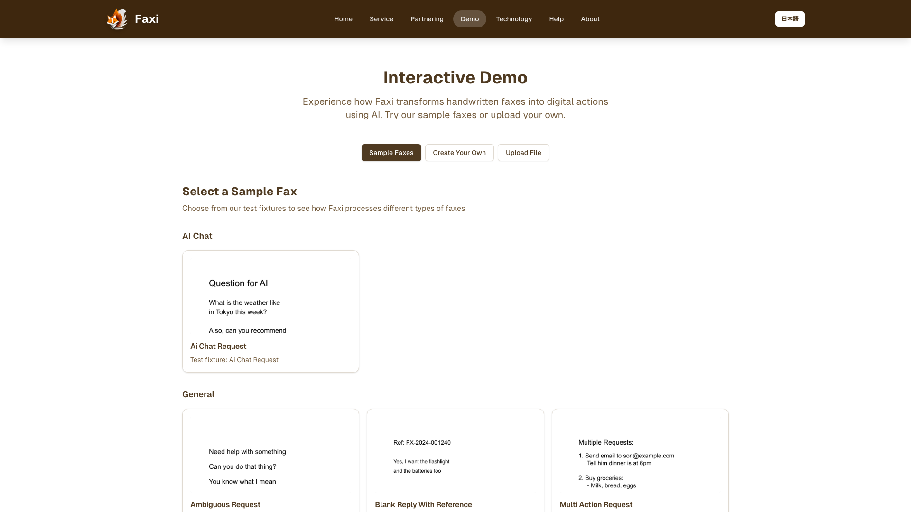
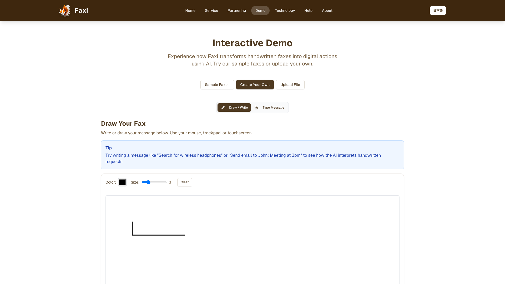
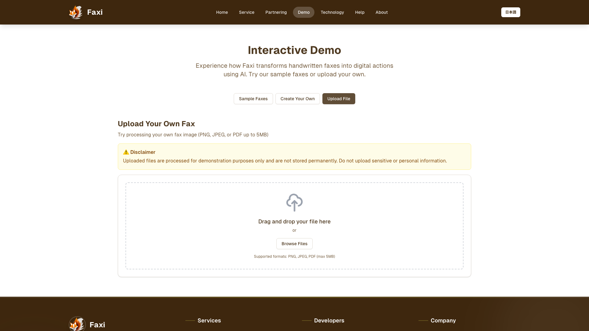

# Faxi Interactive Demo - User Guide

## Overview

The Faxi Interactive Demo allows you to experience how our AI-powered system transforms handwritten faxes into digital actions. You can try sample faxes, create your own custom fax, or upload an existing fax image.

**Access the demo at:** [https://faxi.app/demo](https://faxi.app/demo) or [http://localhost:4003/en/demo](http://localhost:4003/en/demo) (local development)

---

## Getting Started

### Demo Page Layout

When you first visit the demo page, you'll see:

1. **Header** - Title and description of the demo
2. **Mode Toggle** - Three buttons to switch between demo modes:
   - Sample Faxes
   - Create Your Own
   - Upload File
3. **Demo Interface** - Changes based on selected mode
4. **Results Display** - Shows AI interpretation results after processing



---

## Three Ways to Try Faxi

### 1. Sample Faxes (Recommended for First-Time Users)

The easiest way to experience Faxi is with our pre-made sample faxes that demonstrate different use cases.

#### How to Use Sample Faxes:

1. **Click "Sample Faxes"** button (selected by default)
2. **Browse the fixture gallery** - You'll see various sample fax scenarios:
   - Email requests
   - Shopping orders
   - AI chat questions
   - Payment registrations
   - And more...


3. **Click on any sample fax** to preview it
4. **Review the preview** in the dialog that appears:
   - See the fax image
   - Read the description of what it demonstrates
   
<!-- SCREENSHOT:sample-fax-preview-dialog -->
*Note: Screenshot pending - fixtures need to be loaded*

5. **Click "Process Selected Fax"** to see how Faxi interprets it
6. **Wait for processing** - You'll see a loading indicator with status updates

<!-- SCREENSHOT:processing-status -->
*Note: Capture this manually by processing a sample fax*

7. **View the results** - See how Faxi interpreted the fax:
   - Detected intent (email, shopping, Q&A, etc.)
   - Extracted information
   - Planned actions
   - Confidence scores

<!-- SCREENSHOT:results-display -->
*Note: Capture this manually after processing a sample fax*

#### Available Sample Faxes:

- **Email Request** - Demonstrates email composition from handwritten text
- **Shopping Request** - Shows product search and order creation
- **AI Chat Request** - Illustrates Q&A functionality
- **Payment Registration** - Demonstrates payment method setup
- **Email Reply with Circles** - Shows visual annotation detection (circled options)
- **Product Selection with Checkmarks** - Demonstrates checkbox detection
- **Ambiguous Request** - Shows how Faxi handles unclear requests
- **Poor Handwriting** - Tests AI vision with difficult handwriting
- **Multi-Action Request** - Demonstrates handling multiple intents
- **Blank Reply with Reference** - Shows context recovery from previous faxes

---

### 2. Create Your Own Fax

Want to test Faxi with your own handwritten text? Use the custom fax creator!

#### How to Create a Custom Fax:

1. **Click "Create Your Own"** button


2. **Use the drawing canvas**:
   - Write or draw directly on the canvas
   - Use your mouse, trackpad, or touch screen
   - Write naturally as you would on paper

3. **Add your request**:
   - Write an email request: "Send email to john@example.com saying hello"
   - Write a shopping request: "Order 2 boxes of green tea"
   - Ask a question: "What is the weather today?"
   - Add visual marks: Draw checkboxes, circles, or arrows



4. **Click "Process Fax"** when you're done
5. **View the results** - See how Faxi interprets your handwriting

**Tips for Best Results:**
- Write clearly and legibly
- Use simple, direct language
- Include specific details (email addresses, product names, etc.)
- Try adding visual annotations like checkmarks or circles

---

### 3. Upload Your Own Fax Image

Have an existing fax image? Upload it to see how Faxi processes it!

#### How to Upload a Fax:

1. **Click "Upload File"** button


2. **Choose your file**:
   - Click the upload area or drag and drop
   - Supported formats: PNG, JPG, JPEG, PDF
   - Maximum file size: 10MB



3. **Wait for upload and processing**
4. **View the results** - See Faxi's interpretation

**Supported File Types:**
- PNG images (.png)
- JPEG images (.jpg, .jpeg)
- PDF documents (.pdf)

**Best Practices:**
- Use clear, high-resolution images
- Ensure text is readable
- Avoid excessive shadows or glare
- Keep the fax content within the frame

---

## Understanding the Results

After processing any fax, you'll see a detailed results display:

<!-- SCREENSHOT:detailed-results -->
*Note: Capture this manually after processing a sample fax and scrolling through results*

### Result Components:

#### 1. **Intent Detection**
Shows what Faxi thinks you want to do:
- 📧 Email - Send or manage emails
- 🛒 Shopping - Browse or order products
- 💬 AI Chat - Ask questions or get information
- 💳 Payment - Manage payment methods
- 📅 Appointment - Schedule appointments
- 👤 Profile - Update user information

#### 2. **Extracted Information**
Key details Faxi found in your fax:
- Email addresses
- Product names and quantities
- Questions or requests
- Payment details
- Dates and times
- User preferences

#### 3. **Confidence Score**
How confident Faxi is in its interpretation:
- 🟢 High (80-100%) - Very confident
- 🟡 Medium (50-79%) - Moderately confident
- 🔴 Low (0-49%) - Needs clarification

#### 4. **Planned Actions**
What Faxi would do with this fax in production:
- Send an email
- Search for products
- Create an order
- Register payment method
- Schedule appointment
- Update profile

#### 5. **Visual Annotations Detected**
If you used checkmarks, circles, or other marks:
- ✓ Checkmarks detected
- ⭕ Circles detected
- ➡️ Arrows detected
- Location and meaning of each annotation

---

## Common Use Cases

### Use Case 1: Sending an Email

**What to write:**
```
Send email to support@example.com
Subject: Question about service
Message: I would like to know more about your pricing
```

**What Faxi does:**
1. Detects email intent
2. Extracts recipient, subject, and message
3. Composes the email
4. In production: Sends the email and confirms via fax

---

### Use Case 2: Ordering Products

**What to write:**
```
Order:
- 2 boxes of green tea
- 1 package of rice crackers
```

**What Faxi does:**
1. Detects shopping intent
2. Searches for products
3. Adds items to cart
4. In production: Processes order and sends confirmation

---

### Use Case 3: Asking Questions

**What to write:**
```
What is the weather forecast for Tokyo this week?
```

**What Faxi does:**
1. Detects Q&A intent
2. Processes the question
3. Generates an answer
4. In production: Sends answer via fax

---

### Use Case 4: Using Visual Annotations

**What to write:**
```
Which product do you prefer?
[ ] Green tea
[✓] Black tea  ← Draw a checkmark here
[ ] Oolong tea
```

**What Faxi does:**
1. Detects checkmark annotation
2. Identifies selected option (Black tea)
3. Records preference
4. In production: Processes selection

---

## Troubleshooting

### "Processing Failed" Error

**Possible causes:**
- Image quality too low
- Text not readable
- File format not supported
- Server connection issue

**Solutions:**
- Try a clearer image
- Use a sample fax to verify the system is working
- Check your internet connection
- Refresh the page and try again

---

### "No Intent Detected" Result

**Possible causes:**
- Request too vague or unclear
- Handwriting not legible
- Missing key information

**Solutions:**
- Be more specific in your request
- Write more clearly
- Include necessary details (email addresses, product names, etc.)
- Try a sample fax to see proper format

---

### Slow Processing

**Normal processing time:** 5-15 seconds

**If taking longer:**
- Large file size (try compressing the image)
- Server load (try again in a moment)
- Complex request (multiple intents)

---

## Tips for Best Results

### Writing Tips:
1. **Be specific** - Include all necessary details
2. **Write clearly** - Use legible handwriting
3. **Use simple language** - Avoid complex sentences
4. **One request per fax** - Keep it focused (or clearly separate multiple requests)

### Visual Annotation Tips:
1. **Make marks clear** - Use bold checkmarks or circles
2. **Position accurately** - Place marks near the relevant text
3. **Use standard symbols** - ✓, ⭕, ➡️ work best
4. **Avoid ambiguity** - Don't overlap marks

### Image Quality Tips:
1. **Good lighting** - Avoid shadows and glare
2. **High resolution** - At least 300 DPI for scanned images
3. **Proper framing** - Keep content within the image bounds
4. **Clean background** - White or light-colored paper works best

---

## Privacy & Security

### What Happens to Your Demo Faxes:

- **Sample faxes** - Pre-made examples, no personal data
- **Custom faxes** - Processed in real-time, not permanently stored
- **Uploaded faxes** - Temporarily stored for processing, then deleted
- **Results** - Shown only to you, not saved or shared

### Data Protection:

- All processing happens on secure servers
- No personal information is collected in demo mode
- Images are automatically deleted after processing
- Results are not logged or analyzed

**Note:** This is a demo environment. For production use with real personal data, additional security measures and user authentication are in place.

---

## Next Steps

### Ready to Use Faxi for Real?

1. **Contact us** - Get in touch to set up your account
2. **Get a fax number** - We'll provide a dedicated fax line
3. **Start sending faxes** - Use your existing fax machine
4. **Receive confirmations** - Get fax replies with results

### Learn More:

- [How Faxi Works](/tech) - Technical architecture
- [Use Cases](/service) - Real-world applications
- [Partnering](/partnering) - Integration opportunities
- [About Us](/about) - Our mission and team

---

## Frequently Asked Questions

### Q: Is this the real Faxi system?

**A:** Yes! This demo uses the same AI vision and MCP technology as the production system. The only difference is that demo faxes don't trigger real actions (no actual emails sent, orders placed, etc.).

### Q: Can I use this for real requests?

**A:** The demo is for testing and exploration only. For real requests, you'll need a Faxi account with a dedicated fax number.

### Q: What languages are supported?

**A:** Currently, Faxi supports Japanese and English. The AI can understand handwritten text in both languages.

### Q: How accurate is the handwriting recognition?

**A:** Our AI achieves 85-95% accuracy on clear handwriting. Accuracy depends on writing clarity, image quality, and request complexity.

### Q: Can I test with my own fax machine?

**A:** In demo mode, you can upload images or create custom faxes. To test with a real fax machine, you'll need a production account.

### Q: What if Faxi misunderstands my request?

**A:** In production, Faxi sends a clarification fax when confidence is low. You can then provide more details or corrections.

---

## Technical Details

### Processing Pipeline:

1. **Image Reception** - Fax image received
2. **Vision AI Analysis** - Google Gemini 2.0 Flash interprets the image
3. **Intent Classification** - Determines what action is requested
4. **Information Extraction** - Pulls out key details
5. **MCP Tool Selection** - Chooses appropriate tools (email, shopping, etc.)
6. **Action Execution** - Performs the requested action (demo mode: simulated)
7. **Response Generation** - Creates confirmation fax
8. **Fax Reply** - Sends result back to user (demo mode: displayed on screen)

### Technologies Used:

- **AI Vision**: Google Gemini 2.0 Flash
- **MCP Servers**: Email, Shopping, Payment, Appointment, AI Chat
- **Backend**: Node.js, Express, TypeScript
- **Frontend**: Next.js, React, Tailwind CSS
- **Storage**: AWS S3 (MinIO for local dev)
- **Queue**: BullMQ with Redis

---

## Support

### Need Help?

- **Email**: support@faxi.app
- **Documentation**: [docs.faxi.app](https://docs.faxi.app)
- **GitHub**: [github.com/faxi](https://github.com/faxi)

### Report Issues:

Found a bug or have feedback? We'd love to hear from you!
- Open an issue on GitHub
- Email us at support@faxi.app
- Use the feedback form on our website

---

**Last Updated:** December 1, 2025  
**Version:** 1.0.0

